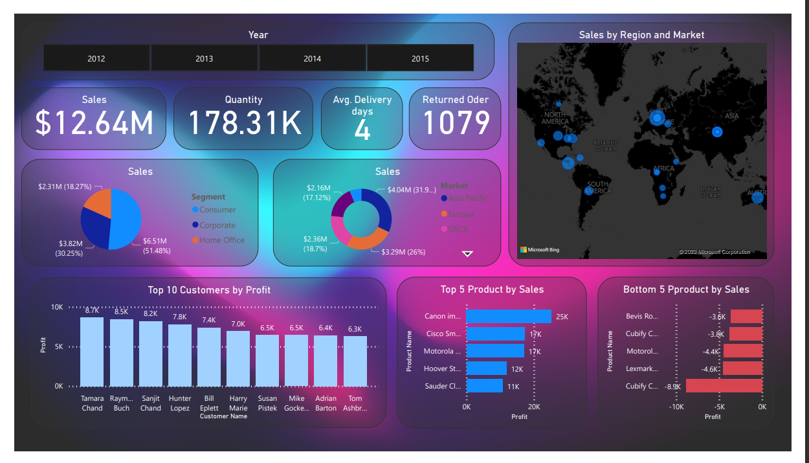

# Power BI Sales Dashboard

## Overview

The Power BI Sales Dashboard is designed to provide a comprehensive view of your sales data, enabling you to monitor key performance metrics and trends. This dashboard provides insights into sales, quantities, delivery times, returned orders, customer profitability, product performance, and regional distribution.

### Key Metrics

The dashboard includes several key metrics on the home page to offer an at-a-glance overview:

- **Sales Card:** Displays the total sales, providing an immediate snapshot of revenue.
- **Quantity Card:** Shows the total quantity of products sold.
- **Average Delivery Days Card:** Presents the average number of days taken for deliveries.
- **Returned Orders Card:** Displays the total number of returned orders.
- **Year Slicer:** Allows users to filter the data by selecting a specific year.

### Visualizations

The dashboard includes various visualizations to help you gain deeper insights into your sales data:

- **Sales by Segments (Pie Chart):** Visualizes sales distribution across different market segments.
- **Sales by Market (Doughnut Chart):** Provides a breakdown of sales across various markets, helping you identify your most significant market segments.
- **Top 10 Customers by Profit (Bar Chart):** Highlights the top 10 customers based on their contribution to profit. It allows you to identify your most valuable customers.
- **Bottom 5 Products by Sales (Bar Chart):** Displays the least performing products based on sales.
- **Sales by Region and Market (Map Chart):** Shows the geographical distribution of sales by region and market. This visualization offers insights into regional performance.

## Data Sources

The dashboard is powered by your sales data, typically retrieved from your organization's sales database. It is recommended to keep the data source updated regularly to ensure the accuracy and relevance of the insights.

## How to Use

- **Year Slicer:** Select a specific year to view sales data for that year.
- **Interact with Visuals:** Most visuals in the dashboard are interactive. You can click on segments of charts, bars, or any data points to drill down into more detailed information.
- **Export Data:** You can export underlying data from the visuals for further analysis.

This Sales Dashboard is a valuable tool for sales teams, management, and other stakeholders. It offers insights that can drive data-informed decisions, helping your organization maximize sales and profitability.